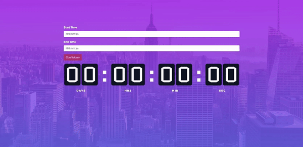

This project was bootstrapped with [Create React App](https://github.com/facebookincubator/create-react-app).

## Available Scripts

In the project directory, after run `npm install` (if you're using npm) or `yarn install` (if you're using yarn), you can run:

### `npm start`

Runs the app in the development mode. 
Open [http://localhost:3000](http://localhost:3000) to view it in the browser.

The page will reload if you make edits. 
You will also see any lint errors in the console.

### `npm test`

Launches the test runner in the interactive watch mode. 
See the section about [running tests](#running-tests) for more information.

### `npm run build`

Builds the app for production to the `build` folder. 
It correctly bundles React in production mode and optimizes the build for the best performance.

The build is minified and the filenames include the hashes. 
Your app is ready to be deployed!

### `npm run prod`

Runs the app in the production mode.
Open http://localhost:5000 to view it in the browser.

Before you run this command, please run the `npm run build` first.

### `Design`

Design is taken from [https://colorlib.com/etc/cs/comingsoon_15/index.html](https://colorlib.com/etc/cs/comingsoon_15/index.html) without commercial purpose.

<!-- ## Simple Countdown Timer

Simple Countdown Timer

Everything here should be coded in HTML and Javascript (ReactJS). You can use any package manager and/or boilerplate you'd like. Please send only source code files in an email (zipped/compressed) with instructions on how to run them.

1. Create an input to take a start time. The input should be in hh:mm:ss format, which represents: hour, minute and seconds, respectively. The input should be a valid input. 

2. Create an input to take an end time. The input should be in hh:mm:ss format. The end time should be a valid input and should represent a time later than the start time. 

3. Create an output div/text/span to represent the countdown counter.

4. Create a button with "Start Countdown" text on it. When user clicks the button, it should:
Verify both inputs' validity, and throw error message if there is a problem, e.g. input format, intervals, etc
Reset the countdown counter output div/text/span
Calculate the number of seconds difference between start time and end time, and display it as the output's initial state
Start decreasing the output by one for every second (behave like a countdown timer)
5. All inputs, output, and button should be rendered in ReactJS.
6. While it is a simple project, please submit a polished work so we could assess your design sense. 
7. Please use Redux for button action and state transition.  -->

